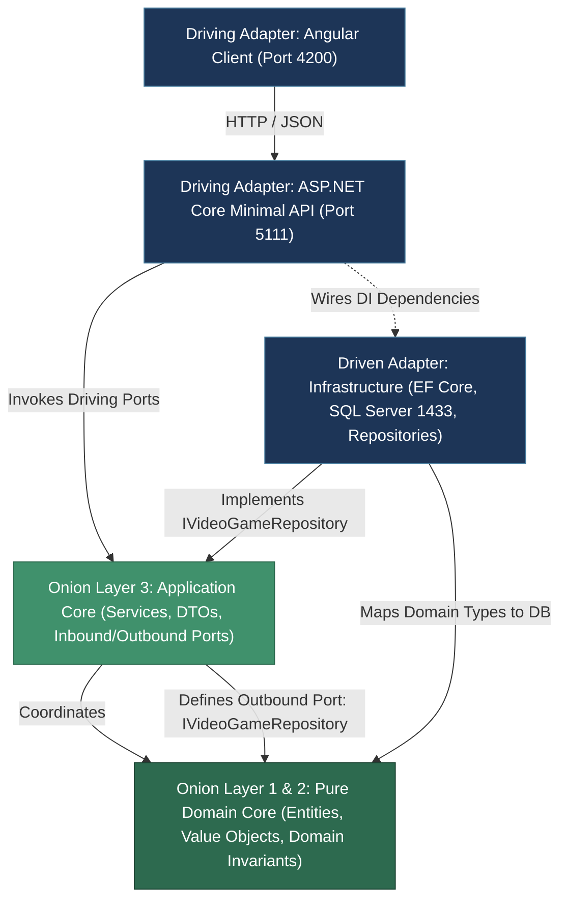
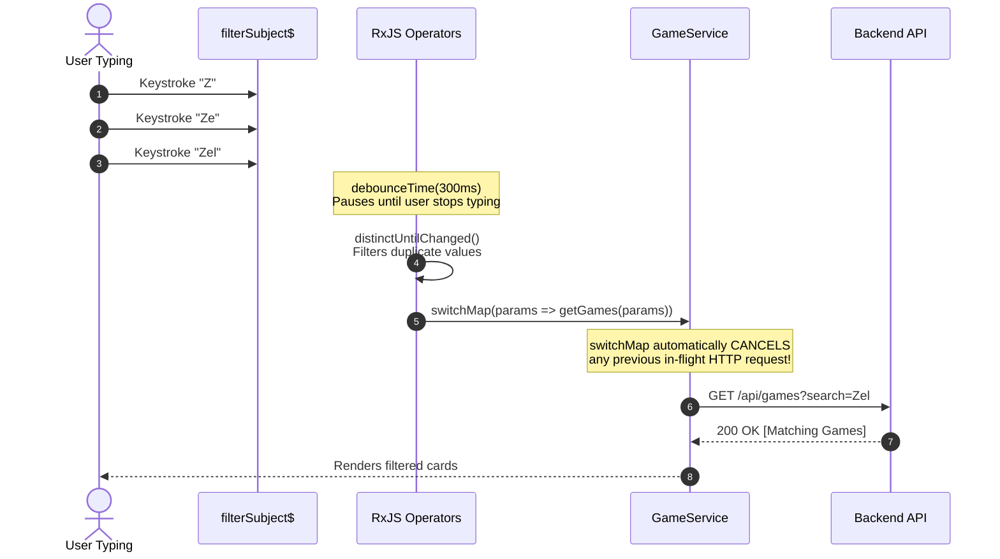
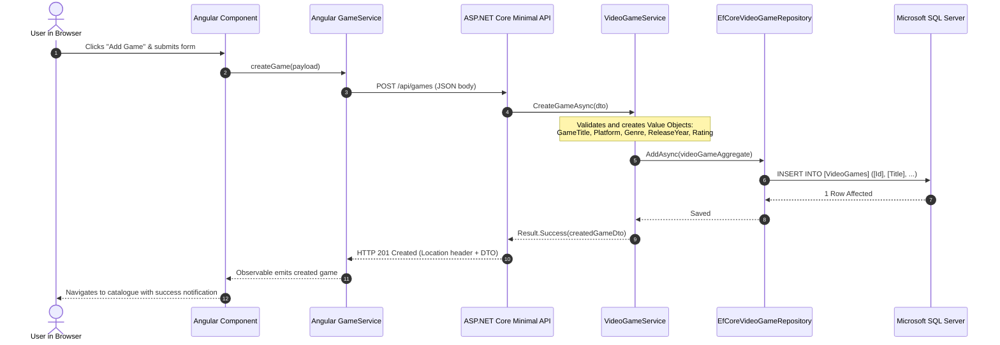

# Architecture of VideoGameCatalogue

## 1. Executive Summary & Architectural Philosophy

**VideoGameCatalogue** is an enterprise-grade, full-stack video game management platform engineered using modern software craftsmanship principles. The architecture is designed to be maintainable, audit-ready, testable, and loosely coupled.

### Core Architectural Paradigms:
1. **Clean & Onion Architecture**: Strict inward dependency rules. The domain core is pure C# and depends on nothing. Outer layers depend inward.
2. **Ports and Adapters (Hexagonal Architecture)**: Core business use cases define **Driving Ports** (what callers invoke) and **Driven Ports** (what infrastructure services the core needs). External technologies (SQL Server, Minimal APIs, Angular) are interchangeable adapters.
3. **Domain-Driven Design (DDD)**: Rich Domain Models, Aggregate Roots, strongly typed Value Objects, and defensive invariant protection.
4. **Modern EF Core Relational Persistence**: Utilizes **EF Core 10 Complex Types (`ComplexProperty`)** to map DDD Value Objects directly to relational SQL Server columns, achieving clean SQL translation with zero hacky type-casts.
5. **Reactive Frontend Architecture**: Angular standalone components leveraging RxJS reactive streams with debouncing and automatic in-flight HTTP request cancellation.

---

## 2. Solution Structure & Layer Breakdown

The solution follows a strict multi-project structure adhering to separation of concerns:

```text
VideoGameCatalogue/
├── src/
│   ├── VideoGameCatalogue.Domain/           # Pure Domain Core (Entities, Value Objects, Errors, Ports)
│   ├── VideoGameCatalogue.Application/      # Use Cases, Services, DTOs, Mappings
│   ├── VideoGameCatalogue.Infrastructure/   # EF Core DbContext, Repositories, SQL Server Configurations
│   ├── VideoGameCatalogue.Api/              # ASP.NET Core Minimal API Endpoints, Middleware, Program.cs
│   └── VideoGameCatalogue.Client/           # Angular Frontend (Standalone Components, RxJS Services)
├── tests/
│   └── VideoGameCatalogue.UnitTests/        # xUnit, FluentAssertions, NSubstitute (Unit + SQL Server Live Tests)
├── docker-compose.yml                       # Microsoft SQL Server Docker container orchestration
└── gemini.md                                # Enterprise Software Engineering Constitution
```

### 2.1 Layer Dependency Graph



---

## 3. Domain Model (The Pure Core)

The `VideoGameCatalogue.Domain` project contains zero third-party dependencies, zero framework references, and zero database attributes. It is 100% pure C#.

### 3.1 Aggregate Root: `VideoGame`
- Represents the transactional boundary for a video game.
- Encapsulates state mutations; properties have `private set`.
- Enforces domain invariants upon instantiation via the factory method `VideoGame.Create(...)`.

### 3.2 Strongly Typed Value Objects
To prevent the **Primitive Obsession** code smell, scalar values are wrapped in immutable `readonly record struct` types:
- `GameTitle`: Enforces non-empty string and max length of 150 characters.
- `Platform`: Enforces valid platform names and max length of 50 characters.
- `Genre`: Enforces valid game genres and max length of 50 characters.
- `ReleaseYear`: Enforces valid release years (1958 to current year + 1).
- `Rating`: Enforces ESRB rating strings and max length of 30 characters.

### 3.3 The Result Pattern (Exception-Free Business Flow)
Domain operations and validations do not throw exceptions for predictable business validation failures. They return a lightweight, strongly typed `Result<T>`:

```csharp
public readonly record struct Error(string Code, string Description);

public class Result<TValue>
{
    public bool IsSuccess { get; }
    public bool IsFailure => !IsSuccess;
    public TValue Value { get; }
    public Error Error { get; }
}
```

---

## 4. Application Layer (Use Cases & Ports)

The `VideoGameCatalogue.Application` project coordinates domain models to fulfill application use cases.

### 4.1 Ports (Interfaces)
- **Driving Port**: `IVideoGameService`
  - Defines the capabilities exposed to outer drivers (APIs, CLI, background workers):
    - `GetAllGamesAsync(searchTerm, platform, genre, ct)`
    - `GetGameByIdAsync(id, ct)`
    - `CreateGameAsync(dto, ct)`
    - `UpdateGameAsync(id, dto, ct)`
    - `DeleteGameAsync(id, ct)`
    - `GetMetadataAsync(ct)`
- **Driven Port**: `IVideoGameRepository`
  - Resides in the Domain/Application boundary.
  - Abstract data access interface requiring no knowledge of EF Core, SQL Server, or relational structures.

### 4.2 Data Transfer Objects (DTOs)
DTOs isolate external contracts from internal entity structures:
- `VideoGameDto`: Read representation returning primitive strings for easy JSON serialization.
- `CreateVideoGameDto` / `UpdateVideoGameDto`: Input contracts validated before domain entity creation.
- `CatalogueMetadataDto`: Supplies client dropdown options (platforms, genres, ratings).

---

## 5. Infrastructure Layer & Persistence Architecture

The `VideoGameCatalogue.Infrastructure` project implements driven ports using **Entity Framework Core 10** targeting **Microsoft SQL Server**.

### 5.1 Complex Type Mapping (`ComplexProperty`)

A common architectural challenge with DDD Value Objects in EF Core is relational LINQ translation failure when using `HasConversion`. `VideoGameCatalogue` solves this using **EF Core Complex Types (`ComplexProperty`)**:

```csharp
public class VideoGameConfiguration : IEntityTypeConfiguration<VideoGame>
{
    public void Configure(EntityTypeBuilder<VideoGame> builder)
    {
        builder.ToTable("VideoGames");
        builder.HasKey(x => x.Id);

        builder.ComplexProperty(x => x.Title, b =>
        {
            b.Property(p => p.Value)
                .HasColumnName("Title")
                .HasMaxLength(GameTitle.MaxLength)
                .IsRequired();
        });

        builder.ComplexProperty(x => x.Platform, b =>
        {
            b.Property(p => p.Value)
                .HasColumnName("Platform")
                .HasMaxLength(Platform.MaxLength)
                .IsRequired();
        });

        // Genre, ReleaseYear, Rating mapped similarly...
    }
}
```

#### Why This Is Superior:
1. **Native SQL Translation**: EF Core treats `.Value` as a mapped column (`[Title]`, `[Platform]`), compiling `g.Title.Value.Contains(search)` directly to T-SQL `[v].[Title] LIKE @search`.
2. **Zero Type Casts**: Eliminates hacky `((string)(object)g.Title)` double-casting.
3. **Provider Agnostic**: The identical LINQ query executes seamlessly on both SQL Server and In-Memory without conditional `isRelational` branching.

### 5.2 Clean Repository Implementation (`EfCoreVideoGameRepository`)
Queries are concise, linear, and satisfy the cyclomatic complexity limit (<= 10):
```csharp
public async Task<IReadOnlyList<VideoGame>> GetAllAsync(
    string? searchTerm = null,
    string? platform = null,
    string? genre = null,
    CancellationToken cancellationToken = default)
{
    IQueryable<VideoGame> query = context.VideoGames.AsNoTracking();

    query = ApplySearchFilter(query, searchTerm);
    query = ApplyPlatformFilter(query, platform);
    query = ApplyGenreFilter(query, genre);
    query = ApplyOrdering(query);

    return await query.ToListAsync(cancellationToken);
}
```

---

## 6. API Layer (Driving Inbound Adapter)

The `VideoGameCatalogue.Api` project hosts the HTTP interface using **ASP.NET Core Minimal APIs**.

### 6.1 Endpoints Design
Endpoints map cleanly to RESTful HTTP semantics under `/api/games`:
- `GET /api/games`: Filtered and debounced catalogue retrieval.
- `GET /api/games/{id}`: Single game detail retrieval.
- `GET /api/games/metadata`: Platform, genre, and rating metadata for UI selectors.
- `POST /api/games`: Add a new game to the catalogue.
- `PUT /api/games/{id}`: Update an existing game.
- `DELETE /api/games/{id}`: Remove a game.

### 6.2 Error Response Standardization (RFC 7807)
Failed commands return RFC 7807 `ProblemDetails` with distinct status codes:
- Validation failure -> `400 Bad Request` with error details.
- Game not found -> `404 Not Found`.
- Duplicate / conflict -> `409 Conflict`.
- Unhandled error -> `500 Internal Server Error`.

---

## 7. Frontend Client Architecture (Angular)

The frontend is an **Angular 19** Single Page Application (SPA) designed with **standalone components** and styled using **Bootstrap 5** and **ng-bootstrap**.

### 7.1 Component Architecture
```text
src/app/
├── core/
│   ├── models/game.model.ts        # TypeScript interfaces matching backend DTOs
│   └── services/game.service.ts    # Centralized HTTP communication service
├── pages/
│   ├── game-list/                  # Catalogue page: Search, Filter, Cards, Delete Modal
│   └── game-edit/                  # Create & Edit form with real-time validation
├── app.component.ts                # App shell, Navbar, Router outlet
└── app.routes.ts                   # Client route definitions
```

### 7.2 Reactive Stream Architecture (Debounce & Race-Condition Protection)

To avoid keystroke storms and HTTP race conditions (where slow earlier responses overwrite faster later ones), search and filter operations use a declarative RxJS pipeline:



---

## 8. Database Architecture & Containerization

### 8.1 Microsoft SQL Server Container
The database engine runs in an isolated Docker container configured via [`docker-compose.yml`](file:///Users/nikola/Documents/source/VideoGameCatalogue/docker-compose.yml):
- **Image**: `mcr.microsoft.com/azure-sql-edge:latest` (Microsoft's official native ARM64 release of the SQL Server engine, ensuring 100% native execution on Apple Silicon and x86_64).
- **Port**: `1433`
- **Database**: `VideoGameCatalogueDb`
- **Initial Seed**: 8 critically acclaimed games spanning NES, SNES, N64, Game Boy, PS2, and modern consoles.

### 8.2 Database Table Schema (`[VideoGames]`)
```sql
CREATE TABLE [VideoGames] (
    [Id]            UNIQUEIDENTIFIER NOT NULL,
    [Title]         NVARCHAR(150)    NOT NULL,
    [Platform]      NVARCHAR(50)     NOT NULL,
    [Genre]         NVARCHAR(50)     NOT NULL,
    [ReleaseYear]   INT              NOT NULL,
    [Rating]        NVARCHAR(30)     NOT NULL,
    [Description]   NVARCHAR(2000)   NOT NULL,
    [CreatedAtUtc]  DATETIME2        NOT NULL,
    [UpdatedAtUtc]  DATETIME2        NULL,
    CONSTRAINT [PK_VideoGames] PRIMARY KEY ([Id])
);
```

---

## 9. Testing Architecture & Quality Gates

The project implements a comprehensive testing pyramid according to the [`gemini.md`](file:///Users/nikola/Documents/source/VideoGameCatalogue/gemini.md) constitution:

```text
       /\
      /  \     End-to-End & UI Verification (Angular DevTools / Manual)
     /----\
    /  15% \   Live SQL Server Integration Tests (Docker Container 1433)
   /--------\
  /   80%    \ Unit Tests (Domain Entities, Value Objects, Application Handlers)
 /------------\
```

### 9.1 Test Coverage Metrics

| Component / Layer | Line Coverage | Branch Coverage | Test Framework |
| :--- | :---: | :---: | :--- |
| **Domain Layer** | **98.59%** | **88.88%** | xUnit, FluentAssertions |
| **Application Layer** | **93.19%** | **93.33%** | xUnit, NSubstitute |
| **Repository Queries** | **100.0%** | **100.0%** | xUnit, SQL Server Container |
| **Angular Client Service** | **100.0%** | **72.72%** | Vitest |
| **Angular Components** | **82.35%** | **80.95%** | Vitest |

### 9.2 Strict Build Quality Gates
1. **Zero-Warning Builds**: Enforced via `<TreatWarningsAsErrors>true</TreatWarningsAsErrors>` and `<Nullable>enable</Nullable>` in [`Directory.Build.props`](file:///Users/nikola/Documents/source/VideoGameCatalogue/Directory.Build.props).
2. **Cyclomatic Complexity <= 10**: Enforced across every method in Domain, Application, and Infrastructure.

---

## 10. End-to-End Data Flow



---

## 11. Architectural Governance & Future Evolution

- **Adding External Integrations (e.g. IGDB / Steam Metadata)**: Add a new Driven Port interface in `VideoGameCatalogue.Domain/Ports` (e.g. `IExternalGameMetadataPort`) and implement the HTTP adapter in `VideoGameCatalogue.Infrastructure/ExternalServices`.
- **Database Migration to Azure SQL / AWS RDS**: Simply modify the connection string in `appsettings.json`; domain and application layers remain completely untouched.
- **Microservice / Modular Monolith Evolution**: If catalogues expand to user reviews, rentals, or inventory, each bounded context can be extracted into its own onion module while maintaining clean boundary ports.
